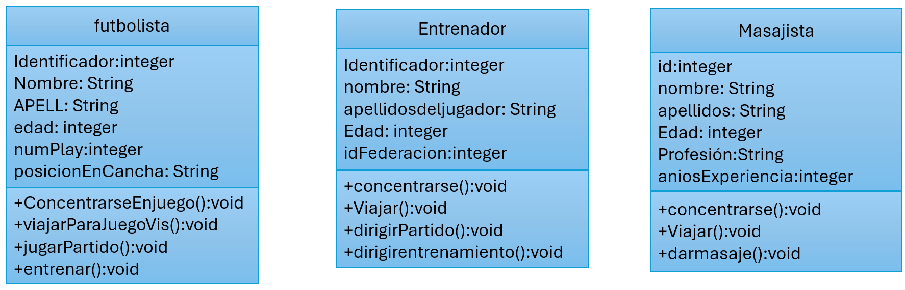

#

Registrar los trabajadores
Cada tipo tiene un id / indice en la lista de tipos

1. Futbolista
2. Entrenador
3. Masajista

en App:
- Agregar trabajador
- Visualizar
    - Filtrar por tipos (1, 2 o 3)
    - Visualizar
- Volver
- Salir

