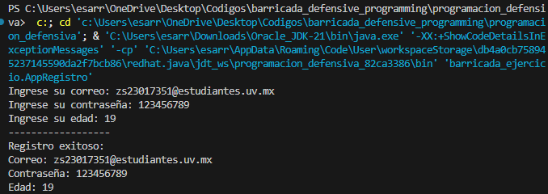
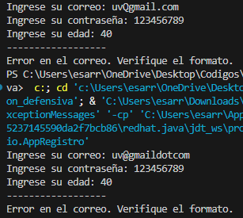
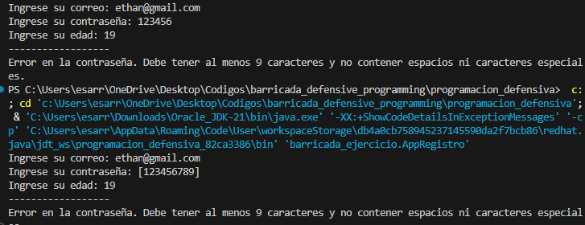
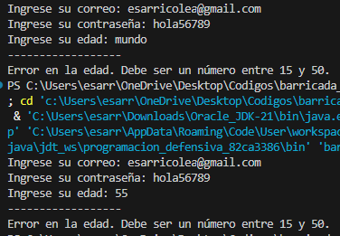

# 🧪 Ejercicio: Validador de Registro de Usuarios

## 🎯 Objetivo
Aplicar el concepto de **barricada en programación defensiva** para validar entradas del usuario antes de construir un objeto confiable en Java.

---

## 📋 Instrucciones

1. **Crear una clase `Usuario`** con los siguientes atributos:
   - `String correo`
   - `String contrasena`
   - `int edad`

   Esta clase debe:
   - Suponer que los datos recibidos ya fueron validados.
   - Contener un método `mostrarInfo()` que imprima los datos del usuario.

2. **Crear una clase `ValidadorUsuario`** que funcione como **barricada de validación**. Debe incluir:

   - `String validarCorreo(String correo)`  
     - Acepta correos que contengan `@` y `.`
     - Devuelve `null` si el correo es inválido.

   - `String validarContrasena(String contrasena)`  
     - Acepta contraseñas de **al menos 9 caracteres**
     - Devuelve `null` si no cumple la condición.

   - `Integer validarEdad(String edadTexto)`  
     - Acepta edades entre **15 y 50 años**
     - Devuelve `null` si no es un número válido o está fuera de rango.

3. **Crear una clase principal `AppRegistro`** que:

   - Pida al usuario que ingrese su correo, contraseña y edad por consola.
   - Use los métodos de `ValidadorUsuario` para validar cada campo.
   - Si todos los campos son válidos:
     - Crea un objeto `Usuario` y muestra su información.
   - Si algún campo no es válido:
     - Muestra un mensaje de error por cada campo fallido.
     - Cancela el registro sin crear el objeto `Usuario`.

---

## 💡 Ejemplo de ejecución exitosa

### Ejemplo de ejecución fallida

Por correo

Por contraseña

Por edad

Por todos

